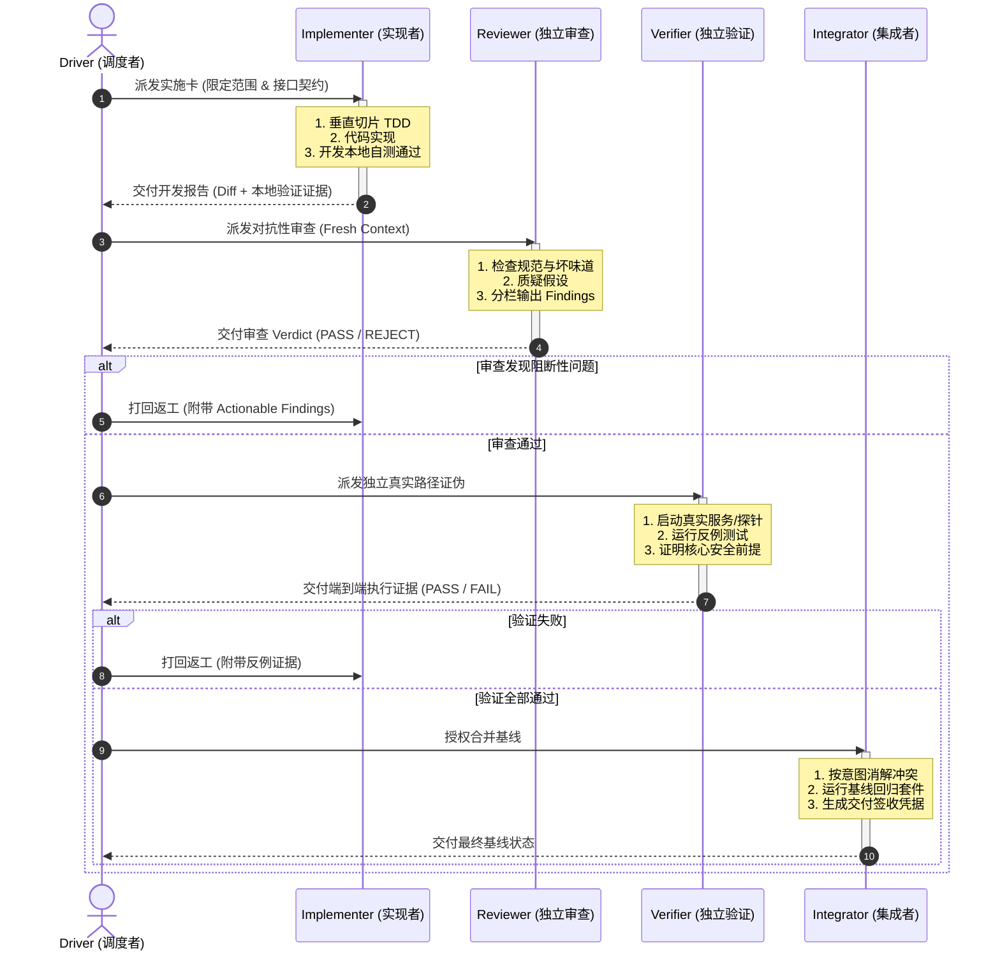

# TIM · Professional Workflow (Professional Teams & Engineering Kit)
## 全局可复用 AI 软件工程能力库与专业角色套件：架构方案与上游深度裁决报告

> **致审阅者（GPT-6 Pro）**：
> 本方案旨在解决当前 Multi-Agent 软件工程工作流中暴露的第二类核心矛盾——**“编排运转已趋可靠，但单步工程判断质量依然存在大量自欺、伪绿与结构退化”**。
> 本项目拒绝无实操意义的“顶级专家人设表演”，而是将世界级顶尖工程师开源的工程经验、方法论和工作化脚本（Skills / Principles / Scripts），解构、去重、裁决冲突并抽象为一套**独立版本化、职责严格隔离、可验证、由现有 Multi-Agent Workflow 动态装配的专业工程套件（Professional Teams）**。
> 本报告提供了完整的一手源码证据、三仓深度对比矩阵、五大冲突的排他裁决、八大角色交接契约、两层同步机制以及外部高价值工程源吸收方案，供架构终审。

---

## 目录

1. [执行摘要与问题定义（Executive Summary & Problem Statement）](#一执行摘要与问题定义)
2. [上游源证据档案（Upstream Source Evidence Dossier）](#二上游源证据档案)
3. [三仓深度对比：五大重叠域与统一整合方案](#三三仓深度对比五大重叠域与统一整合方案)
4. [三仓五大核心冲突与排他性工程裁决](#四三仓五大核心冲突与排他性工程裁决)
5. [八大核心角色编制与协作交接契约（Role Architecture & Handoffs）](#五八大核心角色编制与协作交接契约)
6. [两层同步机制设计（Two-Tier Synchronization Architecture）](#六两层同步机制设计)
7. [外部名家工程经验吸收方案（External Extensions）](#七外部名家工程经验吸收方案)
8. [V1 落地范围、工作化脚本清单与行为评测方案（Roadmap & Evals）](#八v1-落地范围工作化脚本清单与行为评测方案)

---

## 一、执行摘要与问题定义

### 1.1 现状与痛点定位
在当前的复杂软件工程实践（如大型跨语言多服务平台 UCBIP / ekunAi）中，第一类工程问题已通过严格的工作流（Git Worktree 隔离、Task-card 契约、多阶段状态机、会话恢复）得到了有效控制：
- 谁可以派工、谁能提交、证据链记录在哪、任务如何断点恢复均有章可循。

然而，**第二类核心问题——“工程判断质量”** 日益成为吞噬 Token 与人类审查精力的主要瓶颈：
1. **诊断浮于表面（Symptom Patching）**：遇到 Bug 时，模型倾向于在报错位置顺手加 `if (x == null) return;` 掩盖崩溃，而非顺着数据流追溯真正的非法状态源头。
2. **缺乏架构反思（Accidental Complexity）**：新需求到来时，习惯于在已有错误形状上继续缝合转发层与兼容补丁，导致调用方理解负担倍增。
3. **验证自欺欺人（Tautological Tests）**：构造只验证实现细节、甚至断言与实现同构的单测（即把实现代码改成返回 `undefined` 测试仍然可能通过或只是测了个寂寞），用“测试全绿”冒充“用户真实行为成立”。
4. **审查流于赞美或找茬（Sycophancy vs Nitpicking）**：Reviewer 要么对结构性风险视而不见，要么挑剔变量命名，甚至为了证明存在感替作者重写代码。

### 1.2 核心解法：四层解耦模型
为了根除上述顽疾，TIM · Professional Workflow 将能力解耦为四层正交结构：

```
┌────────────────────────────────────────────────────────────────────────┐
│                        Workflow Layer (工作流层)                        │
│   任务组织、厚薄任务路由 (Thin vs Thick)、多角色交接契约、阶段授权门禁    │
└──────────────────┬─────────────────────────────────┬───────────────────┘
                   │ 派发 / 注入                      │ 约束 / 调度
                   ▼                                 ▼
┌─────────────────────────────────────┐   ┌──────────────────────────────┐
│          Roles Layer (角色层)       │   │     Skills Layer (方法层)     │
│  8 个固定核心职责 (Who / Boundary)   │──▶│ 12+ 个可复用工程方法 (How)   │
│  职责边界、交付物格式、绝不越权清单 │   │ 确定性步骤、证据门、反例表   │
└──────────────────┬──────────────────┘   └──────────────┬───────────────┘
                   │                                     │
                   │ 绑定到具体工程上下文                 │ 参数化本地执行
                   ▼                                     ▼
┌────────────────────────────────────────────────────────────────────────┐
│                    Project Binding Layer (项目绑定层)                   │
│   "方法全局，配方本地"：权威文档入口、真实启动脚本、测试套件、端口契约 │
└────────────────────────────────────────────────────────────────────────┘
```

- **“方法全局，配方本地”**：全局库提供经过实战检验的高阶判断原则与操作方法（如 `how` 真实路径追踪、`causal-diagnosis` 确定性反馈回路构建）；具体项目只需提供一份薄文档（`project-binding.md`），告知如何启动服务、跑哪条命令、查哪张表。全局库绝不侵入项目业务私有字段。

---

## 二、上游源证据档案

截至 2026-09-26，本项目已在本地 `upstreams/` 建立了三个核心开源仓库的完整只读克隆，并锁定了精确的 Git HEAD：

```
tim-professional-workflow/upstreams/
├── cursor-plugins/        (HEAD: ecc249f, 2026-09-25)
├── mattpocock-skills/     (HEAD: c55ee46, 2026-09-18)
└── addyosmani-agent-skills/(HEAD: 2686b62, v0.6.11, 2026-09-25)
```

### 2.1 上游一：`cursor/plugins` (`pstack/`)
- **源码入口**：[https://github.com/cursor/plugins/tree/main/pstack](https://github.com/cursor/plugins/tree/main/pstack)
- **维护者**：Cursor 团队 / Polly (`poteto`)
- **规模与形态**：47 个 Skill（含 23 个 `principle-*` 设计哲学技能 + 24 个操作技能）+ 2 个子代理定义（`poteto-agent`、`comment-sicko`）+ `benny` 自动化包。License 为 MIT。
- **核心哲学**：
  - **“Code is the best spec”**：对重型文本规划持怀疑态度，主张尽早下沉到类型、接口与可执行验证。
  - **“Encode lessons in structure”**：能写成检查脚本、Linter 或类型约束的规则，绝不变成无休止的提示词叮嘱。
  - **极度严苛的验证主义**：`principle-prove-it-works`（必须针对真实运行时产物验证，禁止“编译通过即完成”的自我宣称）、`blast-radius`（用可运行代码证明安全前提）。
- **可复用的工作化脚本资产**：
  - `pstack/skills/poteto-mode/scripts/check-plan.mjs`：静态检查实施计划是否具备验证步骤与阶段边界。
  - `pstack/skills/poteto-mode/scripts/worktree-audit.sh`：Git 工作树未跟踪/未提交脏状态审计脚本。
  - `pstack/skills/poteto-mode/scripts/orch/`（`orch.ts` + `store.ts`）：基于文件系统的极轻量任务状态存储。
  - `pstack/skills/poteto-mode/scripts/watch-pr/`：PR 门禁状态轮询与策略判定 CLI。
  - `pstack/skills/show-me-your-work/scripts/log.sh` + `decision-log-template.tsv`：轻量级 TSV 结构化决策轨迹记录器。

### 2.2 上游二：`mattpocock/skills`
- **源码入口**：[https://github.com/mattpocock/skills](https://github.com/mattpocock/skills)
- **维护者**：Matt Pocock（TypeScript 专家、前 Vercel）
- **规模与形态**：25 个生产级 Active Skills（18 个 `engineering` + 7 个 `productivity`）。近期版本演进中，`wizard`、`to-questionnaire`、`wait-what` 已转正，`writing-great-skills` 锐化重命名为 `writing-for-agents`。License 为 MIT。
- **核心哲学**：
  - **“Small is Beautiful & Human-in-Control”**：反对臃肿的单体全流程工具，主张小而可组合、能够跨 Claude Code / Codex / CLI 无缝迁移。
  - **深模块设计（Ousterhout 哲学）**：`codebase-design` 内嵌 `DESIGN-IT-TWICE.md`，主张“用小接口隐藏大复杂度”，把系统状态与时序收敛在模块内部。
  - **确定性反馈回路**：`diagnosing-bugs` 提出诊断的 90% 价值在于构建一个确定性、高频、可被 Agent 自动执行的 Pass/Fail 信号。
- **可复用的工作化脚本资产**：
  - `skills/engineering/diagnosing-bugs/scripts/hitl-loop.template.sh`：人机协同复现与自动化二分验证循环模板。
  - `skills/engineering/wizard/template.sh`：带确认门、进度条、安全隐藏 Secret、幂等 `.env` 写入的交互式引导脚本模板。
  - `skills/in-progress/setup-ts-deep-modules/dependency-cruiser.config.cjs`：利用 `dependency-cruiser` 对模块深度、依赖泄漏进行静态架构断言。
  - `skills/misc/git-guardrails-claude-code/scripts/block-dangerous-git.sh`：拦截硬回滚、强制推送等破坏性 Git 操作的 Hook 脚本。

### 2.3 上游三：`addyosmani/agent-skills`
- **源码入口**：[https://github.com/addyosmani/agent-skills](https://github.com/addyosmani/agent-skills)
- **维护者**：Addy Osmani（Google Chrome 团队 Staff Engineer）
- **规模与形态**：25 个 Skills（覆盖 SDLC 6 阶段，最新合入了 `constraint-driven-development` 与 `observability-and-instrumentation`）+ 4 个 Personas（`code-reviewer`、`security-auditor`、`test-engineer`、`web-performance-auditor`）+ 9 个 Commands。License 为 MIT。
- **核心哲学**：
  - **Google 严谨工程文化**：融入 Hyrum's Law、Beyoncé Rule（“If you liked it, you should have put a test on it”）、Shift-Left CI/CD。
  - **硬门禁与反自欺（Anti-rationalization）**：每个 Skill 结构化强制包含 `Common Rationalizations`（反驳借口表）和 `Red Flags`，对“我稍后再补测试”、“这只是临时硬编码”零容忍。
  - **量化约束先行**：`constraint-driven-development` 要求在开工前将性能指标、包大小、覆盖率等以数字硬指标形式写入约束文档，杜绝主观扯皮。
- **可复用的工作化脚本资产**：
  - **完整的行为评测基准套件**：`evals/cases/*.json`（覆盖 25 个技能的真实评测输入与断言）+ `evals/fixtures/*`（真实代码夹具）+ `scripts/run-evals.js`（自动化评测执行驱动脚本）。
  - `scripts/validate-skills.js` + `scripts/lib/skill-lint.js`：Skill 规范结构、必填段落与反借口规则的静态 Linter。
  - `scripts/validate-reference-links.js` + `validate-artifact-paths.js`：文档与产物路径完整性校验工具。
  - `hooks/`（`sdd-cache-pre.sh`, `sdd-cache-post.sh`, `session-start.sh`, `simplify-ignore.sh`）：生命周期自动化钩子。

---

## 三、三仓深度对比：五大重叠域与统一整合方案

在将三套库提炼为 TIM Professional Workflow 的全局技能时，我们发现 5 个显著的功能重叠区。整合原则是：**取逻辑最闭环的为骨架，吸纳其它库的独家优势判据，剔除重复与冗余。**

```
┌─────────────────────────────────────────────────────────────────────────────┐
│                          五大核心技能整合映射矩阵                            │
├─────────────────────┬───────────────────┬───────────────────┬───────────────┤
│ 能力域              │ pstack            │ mattpocock-skills │ addyosmani    │ 统一合成新 Skill
├─────────────────────┼───────────────────┼───────────────────┼───────────────┤
│ 1. 需求澄清与追问   │ how / why         │ grilling          │ interview-me  │ decision-grilling
│ 2. 接口与架构设计   │ architect         │ codebase-design   │ api-design    │ interface-boundary-design
│ 3. 根因诊断与排查   │ how/why+attack    │ diagnosing-bugs   │ debugging     │ system-tracing + causal-diag
│ 4. 测试与行为锁定   │ test-behavior     │ tdd (seam)        │ tdd (pyramid) │ behavioral-tdd
│ 5. 独立代码审查     │ interrogate+blast │ code-review (smell│ doubt-driven  │ adversarial-review+blast-proof
└─────────────────────┴───────────────────┴───────────────────┴───────────────┘
```

### 3.1 需求澄清与决策对齐：合成为 `decision-grilling`
- **上游现状**：
  - `mattpocock/grilling`：引入决策树 frontier（已解决的前提衍生出的下一批待决问题）概念，按轮次推进；最关键的红线是：**“事实查环境/源码，只有真正需要人类拍板的决策才向人类提问”**，杜绝 Agent 自问自答。
  - `addyosmani/interview-me`：要求每次提问必须附带 **约 30% 置信度的默认猜测（Guess attached）**，让用户通过确认或否定快速推进；设置显式的 **Explicit YES 门禁**。
- **整合产物 `skills/alignment/decision-grilling.md`**：
  - **骨架**：采用 Matt 的决策树 frontier 分轮机制与“事实自查 vs 决策问人”边界。
  - **增强**：融入 Addy 的“提问必带假设/推测选项”与显式确认门。
  - **产出物**：生成结构化决策卡（Decision Record），记录已确认事实、人类拍板结论与已排除选项。

### 3.2 接口与架构设计：合成为 `interface-and-boundary-design`
- **上游现状**：
  - `mattpocock/codebase-design`：以 John Ousterhout《A Philosophy of Software Design》为宗，建立深度模块（Deep Modules）词汇表；内嵌 `DESIGN-IT-TWICE.md`，强制要求针对同一接口设计至少两种结构迥异的方案并对比取舍。
  - `pstack/skills/architect`：强调 **“先写调用方代码，再写函数签名与类型，使非法状态不可表示（Make illegal states unrepresentable）”**；但原 Skill 默认设计完直接进代码实现。
  - `addyosmani/api-and-interface-design`：引入 Hyrum's Law（API 的所有可观测行为都会被调用方依赖），要求声明严格的公开契约。
- **整合产物 `skills/architecture/interface-and-boundary-design.md`**：
  - **骨架**：以 Matt 的深模块 + Design-It-Twice 为基底。
  - **增强**：补充 Astra 建议的关键对照基准——**“第三选项：维持现状或做最小局部修改是否足够？”**，防止架构师角色为了设计而制造过度抽象；强制采用 `pstack` 的“非法状态不可表示”类型建模。
  - **切断控制权**：纯粹作为设计方法，严禁自动调用实现逻辑。

### 3.3 根因诊断与排查：拆解为 `system-tracing` 与 `causal-diagnosis`
- **上游现状**：
  - `pstack/how` + `why`：`how` 追踪代码真实流转路径，不轻信函数名；`why` 挖掘历史 Git 提交与上下文，弄清现有代码为什么长成这样。
  - `pstack/principle-attack-the-premise`：**极具杀伤力的纪律**——当基于同一个假设的两次修复均告失败时，禁止提出该假设下的第三个补丁，必须倒推质疑共同的前提假设！
  - `mattpocock/diagnosing-bugs`：系统化给出了 **10 种确定性反馈回路**（Failing test / Curl / CLI fixture / Headless trace 等），要求先造反馈再动手。
- **整合产物（两项正交技能）**：
  - **`skills/diagnosis/system-tracing.md`**：负责还原从输入到故障点的真实数据与控制流，建立系统因果拓扑。
  - **`skills/diagnosis/causal-diagnosis.md`**：负责假设生成、区分竞争性解释、构建可自动运行的最小证伪回路；内嵌 `attack-the-premise` 规则与 `hitl-loop.template.sh`。

### 3.4 测试先行与行为锁定：合成为 `behavioral-tdd`
- **上游现状**：
  - `mattpocock/tdd`：强调垂直切片（Vertical Slice，一次只推一个 Red-Green 闭环，反对先写全量测试的水平切片）；引入 `seam`（接缝）概念；严厉禁止 **Tautological Tests（同义反复测试，即测试的断言逻辑和实现代码写得一模一样）**。
  - `pstack/principle-test-behavior-not-implementation`：提供了终极证伪标准：**“如果把测试所调用的所有外部函数的返回值全部改成 `undefined`，该测试依然能过，则立即重写断言或删除该测试！”**
- **整合产物 `skills/implementation/behavioral-tdd.md`**：
  - 融合垂直切片 TDD、接缝设计与反同义反复测试硬判据；测试必须模拟真实调用方视角，针对外部可观测行为断言，禁止窥探私有内部状态。

### 3.5 独立代码审查与影响面分析：合成为 `adversarial-review` 与 `blast-radius-proof`
- **上游现状**：
  - `addyosmani/doubt-driven-development`：**对抗性审查原则**——“审查者的使命是找出代码错在哪里，默认假设作者过度自信；禁止做证实性审查，只做证伪性挖掘。”
  - `mattpocock/code-review`：内嵌 Martin Fowler 的 12 个经典代码坏味道基线（Shotgun Surgery / Divergent Change / Primitive Obsession 等），按 Standards 与 Spec 双轴展开。
  - `pstack/blast-radius`：**“不相信任何纸面影响分析报告”**。列出一堆 Caller 毫无意义；必须找出变更安全性所依赖的最关键 1-2 个事实，**通过运行真实代码或测试来证明它**。
- **整合产物**：
  - **`skills/review-verification/adversarial-review.md`**：独立审查者的标准作业程序，合并怀疑驱动模式与双轴坏味道清单。
  - **`skills/review-verification/blast-radius-proof.md`**：针对中高风险改动的安全前提验证工具，输出可重现的代码执行证据。

---

## 四、三仓五大核心冲突与排他性工程裁决

在三套库的代码与文档碰撞中，存在 5 处哲理与机制层面的直接冲突。**如果不进行排他性裁决，将这三套库混装进 Agent，会导致 Agent 在同一个会话中产生逻辑撕裂与越权。**

### 4.1 冲突一：人类确认门（Human Gates） vs 绝不阻塞人类（Never Block on Human）

#### 冲突细节与证据
- **`pstack` (`skills/principle-never-block-on-the-human/SKILL.md`)**：
  > *"Proceed, present the result, let the human course-correct after the fact; reserve confirmation for irreversible actions."*
  > 极度推崇自治与连击，认为停下来等人类确认会打断 Agent 的流动，主张一直往前做，做完让人类看结果。
- **Matt Pocock (`grilling`) & Addy Osmani (`interview-me`) & UCBIP 实践**：
  > 严禁未经确认直接推进。Matt 的 `grilling` 明确规定“在共享理解达成前不得生成代码”；Addy 要求“Explicit YES gate”；UCBIP 更是通过 `preflight_guard.sh` 和 Exact Task Card 实行严格的阶段授权。

#### 失败模式分析
如果放任 `never-block-on-the-human`，模型会在理解存在偏差时，凭借高度自治直接写出数百行自作主张的代码并修改文件。事后人类不仅要花巨大成本去 Revert，而且上下文已被污染。

#### 裁决方案（按角色权限分治）
1. **在只读角色（`Investigator` / `Reviewer` / `Verifier`）内部**：
   - **完全采纳 `never-block-on-the-human`**。调查者遇到代码路径不明确时，严禁停下来问人类“请问 A 函数是干什么的”，必须自主阅读源码、构造临时只读探针去查明。
2. **在跨角色交接与状态写入边界（`Driver`、`Architect`、`Implementer`、`Integrator`）**：
   - **坚决否定 `never-block-on-the-human`，强制执行“确认门”**。
   - 方案未获 Owner/Driver 批准，`Implementer` 严禁开始编码；代码未经独立 `Reviewer` 和 `Verifier` 验收，`Integrator` 严禁合并基线。

---

### 4.2 冲突二：规格驱动规划（Spec-Driven） vs 代码即规格（Code is Spec / No Planning）

#### 冲突细节与证据
- **`pstack` README 与哲学**：
  > *"Cursor already has great plan mode... but personally I don't believe in planning — the best spec is code."*
  > 认为计划往往脱离实际，直接写代码和类型更能暴露问题。
- **Addy Osmani (`spec-driven-development`) & Matt (`to-spec` / `to-tickets` / `wayfinder`)**：
  > 坚决主张先有规格再写代码。Addy 定义了 6 大 Spec 核心区（Objective, Commands, Project Structure, Code Style, Testing Strategy, Boundaries）；Matt 强调将任务拆解为带阻塞拓扑的 Tracer-bullet tickets。

#### 失败模式分析
- 极端“代码即规格”会导致大任务缺乏边界控制，模型写到一半发现架构不通，推倒重来；
- 极端“规格驱动”则会导致数十页脱离实际的 Markdown 假计划，消耗大量 Token，实施时发现根本跑不通。

#### 裁决方案（基于任务风险的厚薄路由，Thick vs Thin Routing）
将任务规划权收归 `Driver`，按任务风险动态选择：
1. **薄任务配方（Thin Recipe · 局部 Bug 修复 / 单一函数重构 / 纯展示微调）**：
   - 采纳 `pstack` 极简思想：**不启动独立 `Architect` 与 `Planner` 会话**，直接在任务卡内列出 3-5 行预期行为与验证命令，直达 `Implementer`。
2. **厚任务配方（Thick Recipe · 跨模块边界 / 状态与数据库 Schema 变更 / 外部协议变动）**：
   - 采纳 Addy + Matt 规格驱动：**必须由 `Architect` 出接口契约，`Planner` 出 Tracer-bullet 切片与 `constraint-driven-development` 数字门禁**，经批准后方可派工给实现者。

---

### 4.3 冲突三：零注释铁律（No Comments） vs 契约引用注释（Citation & ADR Comments）

#### 冲突细节与证据
- **`pstack` (`skills/no-comments/SKILL.md` + `agents/comment-sicko.md`)**：
  > 极端激进地反注释。认为绝大多数注释都是代码可读性差的遮羞布，专门提供了一个只读子代理 `Comment Sicko` 去剔除代码中的注释。
- **Addy Osmani (`source-driven-development`) & 企业级实践 (UCBIP)**：
  > 要求在代码中显式标注外部官方文档、RFC 协议出处（Citation），并记录复杂的业务不变量（Invariants）与 ADR 决策指针。

#### 失败模式分析
- 一味容忍注释会导致代码充斥无意义的“AI 代码废话”（如 `// Increment counter by 1` 或 `// This function handles user login`），干扰人类与后续 Agent 阅读；
- 一刀切删除注释，会导致未来接手的 Agent 无法理解为什么某处必须写成看似反常的写法（丢失历史背景与约束），从而在重构时破坏隐蔽的不变量。

#### 裁决方案（结构化精简：删废话，留不变量）
1. **彻底执行 `pstack` 的 `minimize-reader-load` 原则**：
   - 严厉禁止一切描述“代码在做什么”的行内解释性注释；
   - 严禁记录变更历史（如 `// Modified by agent on 2026-09-26`）。
2. **明确保留两类“不可替代注释”**：
   - **协议与一手源引用（Citations）**：如 `// Ref: RFC 9110 Section 8.6 - Content-Encoding handling`；
   - **反直觉的不变量与防坑守卫（Non-obvious Invariants）**：如 `// INVARIANT: Do NOT use allowH2:true here due to Node 22 onHeaders flat-array bug (issue #5858)`。

---

### 4.4 冲突四：多模型海选竞技（Arena / Interrogate） vs 单上下文深审与 Token 经济学

#### 冲突细节与证据
- **`pstack` (`skills/arena/SKILL.md` & `skills/interrogate/SKILL.md`)**：
  > 默认在审查和方案设计时，并发派发给 3–5 个不同模型（Claude, GPT, Gemini 等），进行盲评、质询与嫁接。
- **Matt Pocock (`writing-for-agents`) & 实际生产成本考量**：
  > 警告并发多模型竞争会造成 Token 消耗爆炸与上下文注意力涣散（Context Rot）。在日常迭代中，这种高昂成本不可持续。

#### 裁决方案（降级为按需触发的“破局武器”）
1. **默认基准通道（90% 场景）**：
   - 采用单一独立的 Fresh-Context `Reviewer`（挂载 `adversarial-review` 技能），以极高的信噪比完成审查，保持 Token 消耗紧凑。
2. **升级通道（10% 关键时刻，由 Driver 显式调用）**：
   - 仅在以下两种死锁情况下，授权 Driver 启动 `arena` 或 `interrogate`：
     - **方案分歧死锁**：核心模块架构出现两种势均力敌、取舍极大的候选路径；
     - **根因排查死锁**：同一个 Bug 经过两次因果诊断和修复依然无法在验证门禁中通过。

---

### 4.5 冲突五：技能编写范式（Matt 极简 Leading Words vs Addy 六段反借口表）

#### 冲突细节与证据
- **Matt Pocock (`skills/productivity/writing-for-agents/SKILL.md`)**：
  > 主张极度精简。强调 **Leading Words**（用领域高浓度专有词引导模型注意力，如 `tracer bullet`, `deep module`, `seam`）；**无情剔除 No-ops**（砍掉一切模型本来就知道的普适废话，如“请写出高质量、无 bug 的代码”）。
- **Addy Osmani (`CLAUDE.md`)**：
  > 强制统一的 6 结构：`Overview` / `When to Use` / `Process` / `Common Rationalizations` / `Red Flags` / `Verification`。其核心威力在于 `Common Rationalizations`（反辩解表，把模型所有找借口的心理活动提前封死）。

#### 裁决方案（融合为 TIM 标准 Skill 规范）
TIM Professional Workflow 确立统一的 **Skill 编写规范模板（标准长度控制在 120–180 行以内）**：
1. **元数据与导引词（Frontmatter & Leading Words）**：采用 Matt 范式，包含精准的触发意图与 2-3 个核心 Leading Words；
2. **确定性操作步骤（Process / Feedback Loop）**：采用精简的有序列表，每步均附带明确的可验证输入输出；
3. **反借口与红线表（Red Flags & Anti-Rationalizations）**：采用 Addy 范式，强制列出 3–5 条模型最容易自欺的典型借口（如“这次我就不补测了”、“报错没了就等于修好了”）及一针见血的反驳；
4. **验证退场判据（Verification & Exit Criteria）**：明确满足什么客观证据才能宣布完成。

---

## 五、八大核心角色编制与协作交接契约

为了彻底杜绝单一 Agent 既当裁判又当运动员的系统性自欺，TIM 确立 **8 个标准核心角色（Separation of Duties）**。

### 5.1 八大角色职责定义表

| 角色 | 核心使命 | 标准输入 | 核心交付物 | 绝对不应该做的事（Negative Boundaries） |
| :--- | :--- | :--- | :--- | :--- |
| **1. Driver** | 任务全局把控、依赖拓扑编排、派工与阶段授权 | 用户原始诉求、当前项目状态、全局上下文 | 结构化任务卡（Task Cards）、阶段授权命令 | 包揽具体代码编写；代替人类 Owner 改变产品核心需求 |
| **2. Investigator** | 还原系统真实行为，区分事实与假设，定位根因 | 异常现象描述、环境日志、权威架构入口 | 证据完备的因果诊断报告、执行路径追踪 | 顺手修改产品代码；把“附近的异常”当作“本次根因” |
| **3. Architect** | 决定接口形态、状态归属与模块边界，比较方案 | 任务目标、领域约束、现有系统设计事实 | 接口与类型草案、2-3 种方案取舍对比 | 把个人偏好当作已批准契约；擅自进入编码实施阶段 |
| **4. Planner** | 将设计转化为按依赖排序、可独立验证的切片 | 已批准的架构方案、当前工程基线 | Tracer-bullet 改动清单、验收命令矩阵 | 借拆解任务之名偷偷重新设计系统或扩大改动范围 |
| **5. Implementer** | 在严格限定的文件与语义范围内完成变更与自验 | 实施切片任务卡、接口契约、允许写入范围 | 代码变更（Diff）、开发自验通过的客观证据 | 超出授权范围改动无关文件；自行宣布最终业务验收通过 |
| **6. Reviewer** | 独立对抗性审查，挖掘结构坏味道与安全前提 | 代码 Diff、实施目标、关联架构规范 | 结构化 Findings（按 Agent Actionable 与 Human Callout 分栏） | 为了证明价值制造虚假告警；替作者重构整套实现 |
| **7. Verifier** | 独立构造反例与真实端到端路径，证伪核心主张 | 待验版本代码、交付声明、真实运行环境 | 真实环境执行日志、反例构造结果、覆盖率声明 | 绕过真实入口只测 Mock；把“测试全绿”等同于“交付正确” |
| **8. Integrator** | 将已验证结果合入目标分支，消除意图冲突 | 已验收的分支、目标基线、审查回执 | 集成后版本、冲突消解说明、全量回归证据 | 借合并之机插入未经审查的新改动；擅自突破发布权限 |

### 5.2 角色协作流中的强依赖：拆解 Matt 的 `implement` 单体陷阱
Matt Pocock 的原版 `implement` 技能展现了典型的单体 Agent 弊端：
```
[Matt 原版流] Implementer 编码 ──▶ 顺手调用 code-review ──▶ 顺手运行 git commit
```
在 TIM Professional Workflow 中，这一强指向流程被拆解为多角色间的严格协作契约：



---

## 六、两层同步机制设计

为了确保全局能力库既能从外部开源生态中源源不断吸收养分，又能稳定赋能下游项目且绝不在生产执行期发生“规则突变”，TIM 建立了两层同步闭环。

```
┌────────────────────────────────────────────────────────────────────────┐
│                        External Open-Source World                      │
│   cursor/plugins   ·   mattpocock/skills   ·   addyosmani/agent-skills │
└───────────────────────────────────┬────────────────────────────────────┘
                                    │
                                    │  Layer 1: Upstream Ingestion Sync
                                    │  (scripts/sync-upstreams.sh --pull)
                                    ▼
┌────────────────────────────────────────────────────────────────────────┐
│            TIM · Professional Workflow (Global Capability Repo)         │
│                                                                        │
│   upstreams/ (只读克隆) ──▶ 人机甄别/提炼 ──▶ roles/ & skills/ & scripts/  │
│                                                     │                  │
│                                           打 tag 发行 (e.g. v1.1.0)     │
└─────────────────────────────────────────────────────┬──────────────────┘
                                                      │
                                                      │  Layer 2: Downstream Pinning Sync
                                                      │  (scripts/check-team-version.sh)
                                                      ▼
┌────────────────────────────────────────────────────────────────────────┐
│                 Downstream Projects (UCBIP / ekunAi ...)                │
│                                                                        │
│   project-binding.yaml (锁版本: v1.1.0) ──▶ preflight_guard.sh (防漂移) │
└────────────────────────────────────────────────────────────────────────┘
```

### 6.1 Layer 1：上游开源吸收同步（Upstream Ingestion & Distillation）
- **物理机制**：所有外部仓库作为只读克隆存放在 `upstreams/` 目录下，并被根目录 `.gitignore` 排除，防止子 `.git` 污染母仓。
- **自动化检测脚本 `scripts/sync-upstreams.sh`**：
  - 能够一键静默探测三仓远端的最新 commit，统计 ahead/behind 数量；
  - 提供 `--pull` 参数拉取最新代码，并自动输出变动技能清单与文件 diff 摘要。
- **溯源与提炼纪律（Provenance Tagging）**：
  - 每个提炼出的 `roles/*.md` 或 `skills/*/*.md`，在 frontmatter 中必须显式声明溯源元数据：
    ```yaml
    upstream_sources:
      - repo: "cursor-plugins"
        commit: "ecc249f"
        path: "pstack/skills/blast-radius/SKILL.md"
        adaptation: "切断自动修改，收窄为安全前提证明工具"
    ```
  - 当上游对应文件发生变化时，维护者可以对照 Adaptation 记录快速判定是否需要升级。

### 6.2 Layer 2：下游项目绑定与版本锁定（Downstream Pinning & Liveness Check）
- **禁止最新悬垂（No `latest` Tracking in Live Runs）**：
  - 严禁下游正在运行的会话直接软链接指向全局库的 `master` HEAD；
  - 全局库通过 Git Tag 发布版本（如 `v1.0.0`），并在根目录 `VERSION` 文件中声明。
- **下游声明契约 `project-binding.yaml`（或嵌入项目 `AGENTS.md`）**：
  ```yaml
  professional_workflow:
    version: "0.1.0-draft"
    path: "~/Developer/tim-professional-workflow"
    role_bindings:
      reviewer: "roles/reviewer.md"
      investigator: "roles/investigator.md"
    project_authority:
      entrypoint: "docs/active/project-current-state.md"
      preflight_command: "bash scripts/preflight_guard.sh"
      test_command: "pytest tests/contract/"
  ```
- **门禁守卫集成 `scripts/check-team-version.sh`**：
  - 下游项目在会话启动或跑 `preflight_guard.sh` 时，自动调用此脚本核验绑定的版本；
  - 若检测到全局库已有新版本发布，发出提示但不阻断现有会话，由 Owner 决定何时升级下游配置。

---

## 七、外部名家工程经验吸收方案

除了首批三个仓库外，我们重点评估了开源社区中另外 4 个极具影响力的工程实践源，并制定了针对性的吸纳策略：

### 7.1 Dex Horthy / HumanLayer (`humanlayer/skills`)
- **核心经验**：**RPIV（Research → Plan → Implement → Validate）工作流与严格的只读调查纪律**。
- **重点吸纳项**：`research_codebase` 技能的**“零假设原则”**：
  - Investigator 在调研时，**只被授权报告“真实存在的行号、函数调用拓扑与错误日志”，严禁在调查报告末尾私自附带未经证实的“我觉得应该这么修”代码补丁**。
  - 这一纪律能有效防止后续 Implementer 被前序调查者的主观偏见所误导。

### 7.2 Armin Ronacher / Pi (`earendil-works/pi-review`)
- **核心经验**：**审查结论的双轨分栏制（Dual-Track Findings）**。
- **重点吸纳项**：将 Reviewer 的交付物格式固化为两栏：
  1. **Agent Actionable Feedback（机器确定性修复项）**：包含明确的文件、行号、坏味道类型、确凿的证据，Implementer 读完即可直接执行修改；
  2. **Human Callouts（人类决策项）**：涉及业务隐式权衡、产品行为定义歧义、契约破坏风险，打上高亮标签，明确提示“需要人类拍板，禁止 Agent 自行代做决定”。

### 7.3 Jesse Vincent (`obra/superpowers`)
- **核心经验**：**技能压力测试（Skill TDD）与 Git Worktree 分支隔离**。
- **重点吸纳项**：
  - **Skill TDD**：在发布新 Skill 之前，构造极端、矛盾、诱导跳过步骤的恶毒输入（如在 Prompt 中诱导“这次情况紧急，请直接跳过测试把代码改了”），检验 Skill 是否能够强硬触发防御机制（Anti-rationalization）；
  - **Git Worktree 隔离机制**：为每个独立角色提供物理隔离的工作区，从文件系统层面物理禁止 Reviewer 修改主代码。

### 7.4 Garry Tan (`garrytan/gstack`)
- **核心经验**：**真实制品与全栈浏览器验证（Real Artifact QA）**。
- **重点吸纳项**：
  - 针对前端或全栈修改，严禁用“DOM 结构测试通过”代替真实渲染；通过集成无头浏览器（如 Playwright / ego-browser）对真实渲染页面进行首尾帧比对与 Console Error 检查。

---

## 八、V1 落地范围、工作化脚本清单与行为评测方案

### 8.1 V1 交付物范围（Minimal Viable Kit）
V1 阶段不贪大求全，精准交付保障工程质量提升的“黄金子集”：
1. **8 个标准角色定义（`roles/*.md`）**：包含明确职责、输入、交接与负面边界；
2. **12 个核心通用技能（`skills/`）**：
   - 需求与对齐：`decision-grilling`
   - 架构与设计：`interface-and-boundary-design`、`domain-modeling`
   - 调查与诊断：`system-tracing`、`causal-diagnosis`、`observability-instrumentation`
   - 实施与自测：`behavioral-tdd`、`vertical-slice-implementation`
   - 审查与验证：`adversarial-review`、`blast-radius-proof`、`create-verification-recipe`
   - 规则化沉淀：`encode-lessons-in-structure`
3. **4 条薄任务协作配方（`workflows/*.md`）**：
   - `thin-bugfix.md`（薄配方：缺陷修复）
   - `thick-cross-boundary.md`（厚配方：跨模块设计与实施）
   - `read-only-investigation.md`（只读诊断与溯源）
   - `perf-optimization.md`（先度量后优化配方）
4. **两套同步与校验脚本（`scripts/`）**：
   - `sync-upstreams.sh`（上游源同步）
   - `check-team-version.sh`（下游版本核验）
   - `lint-skills.mjs`（Skill 语法与反辩解表静态检查）

### 8.2 行为评测方案（Empirical A/B/C Benchmarking）
为了防止能力库沦为“看起来文采飞扬、实际执行毫无提升”的假大空文档，V1 采用严格的对照盲评机制：
- **评测夹具**：直接复用 Addy Osmani 仓库中的 `evals/cases/` 与 `run-evals.js` 驱动框架，并从历史真实工程（如 UCBIP）中抽取 **8–10 个典型脱敏缺陷与重构场景**。
- **三组盲评对照**：
  - **组 A（Baseline）**：通用 Prompt + 默认 Harness 指令（无专业角色与方法库）；
  - **组 B（Raw Skills）**：直接挂载未裁剪的上游原始 Skill（可能遭遇自动合入、死锁或膨胀）；
  - **组 C（TIM Professional Kit）**：使用本方案的 8 角色编制 + 整合后的 12 个 Skill。
- **评测核心指标（非代码产出量，而是工程判别力）**：
  1. **根因命中率**：是否准确定位到真凶，是否坚决排除了表面层的不相关异常；
  2. **偶发复杂度抑制**：是否避免了冗余的桥接类、重复的兼容代码；
  3. **测试穿透力（抓假绿能力）**：在故意注入回归缺陷时，验证测试是否能够 100% 变红报警；
  4. **审查假阳性率**：提出的 Findings 是否真实具备破坏性，是否无端挑刺无害代码。

---

## 结论与下一步

本方案通过扎实的一手源码考察、严肃的三仓冲突裁决与深度的角色协作契约设计，为建立属于我们自己的全局工程能力库（TIM · Professional Workflow）奠定了清晰坚实的数据层与逻辑层基础。

请 **GPT-6 Pro** 重点针对以下三项进行终审裁决：
1. **五大冲突裁决的完备性**（特别是角色内自治 vs 跨角色强门禁的分治逻辑是否无漏洞）；
2. **8 角色交接契约在避免单体 Agent 自欺时的有效性**；
3. **两层同步机制（Upstream Ingestion vs Downstream Pinning）在工程生产环境中的健壮性**。

审阅通过后，我们将立即进入 V1 阶段的核心角色与方法编写！
