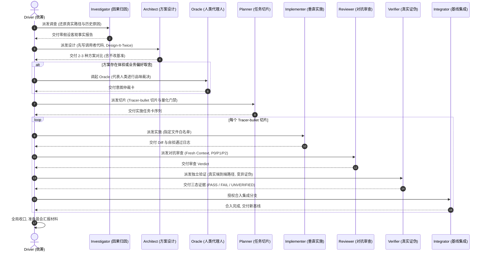

# Thick Cross-Boundary Workflow · 厚任务配方

## 1. 适用场景
- 涉及两个以上核心模块间的契约或通信协议调整；
- 共享状态的写入权归属重新划分；
- 数据库 Schema、持久化层结构演进；
- 重构现有复杂流程、拆分大型服务或实现全新的业务特性。

## 2. 全链路 9 角色严密协作流

## 3. 厚任务硬性约束
1. **接口先行**：未产出经批准的强类型接口草案前，Implementer 严禁动工。
2. **切片垂直**：任务必须拆解为端到端可独立运行的 Tracer-bullet 切片，禁止横向堆砌未经验证的中间层代码。
3. **安全前提证明（Blast-radius Proof）**：必须运行真实代码证明改动不会破坏既有外部模块依赖。
