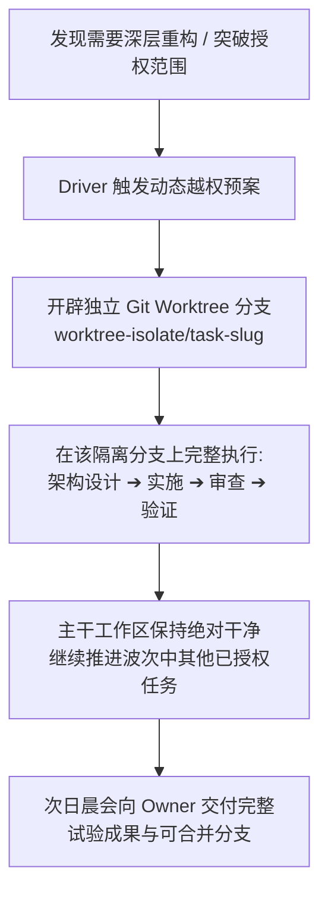

# Wave Protocol · 波次运行规程

## 1. 规程概述
本规程是 TIM · Professional Workflow 面向**过夜无人值守（如 23:30 对齐，00:00–08:00 执行，08:30 晨会）**的核心标准化运行协议。其精髓在于：**“开始时充分对齐，运行中授权闭环，越权时独立隔离，结束时大白话看成果”**。

---

## 2. 阶段一：波次启动对齐（23:30 · 必须说人话）

Driver 主动与人类 Owner 发起多轮自然语言大白话对话，严禁使用技术黑话，逐步锁定以下 4 个关键事实：

### 对话模版示例（Driver 的大白话范例）

> **Driver**：“晚上好！今晚的开发时间大约有 8 个小时。我们先简单对一下今晚要做的事情：
> 1. 您希望今晚重点攻克哪几个具体问题？（例如：修复某处导出失败、还是搭建新模块？）
> 2. 权限上，我们允许修改哪些业务模块？是否有绝对不能动的文件或数据？
> 3. 我刚才检查了一下当前的工具环境，支持多模型和测试隔离。我建议将高推理模型分配给架构师、审查员和先知角色，普通模型分配给写代码的实现者，您看合适吗？
> 4. **越权预案**：如果夜间调查发现某个问题很复杂，需要大改核心结构，我们会自动开辟一个独立的测试分支去完整试验，绝对不碰当前可用的主干代码，明早向您汇报试验结果供您决定。这样定可以吗？”

### 锁定产出：《波次授权契约（Wave Authorization Context）》
- **目标清单**：任务 A、任务 B、任务 C（按优先级排序）；
- **权限边界**：允许变更的代码范围、允许写入的本地集成分支（如 `local/dev-integration`）；
- **动态越权预案**：确认启用 Git Worktree 隔离试验机制；
- **模型与推理档位映射表**；
- **项目文档模式**：自动映射已有文档（如 UCBIP）或征得同意后引入轻量规范。

Owner 回复一句“确认，去执行吧”，波次正式启动。

---

## 3. 阶段二：授权内自主闭环推进（00:00–08:00）

在既定授权边界内，团队 9 个角色**100% 自主运转，任何角色间的日常交接严禁唤醒或询问人类**：
1. **任务分流**：Driver 识别任务厚度（局部小改走薄配方，跨模块大改走厚配方）；
2. **实施与自测**：Implementer 在规定白名单内垂直切片编码，自测通过；
3. **独立审查**：Reviewer（新鲜上下文）对抗性挖掘，按 P0/P1/P2 输出 Findings；
4. **意图仲裁（Oracle 入场）**：遇到 P2（人类体验或权衡项），由 **Oracle** 代替人类做品味仲裁，记录仲裁卡；
5. **端到端验证**：Verifier 构造反例变异测试，三态输出 `PASS` / `FAIL` / `UNVERIFIED`；
6. **按因归属返工**：若失败，精准路由给 Implementer（Bug）、Architect（设计缺陷）或 Verifier（环境问题）；
7. **合入集成分支**：Integrator 按意图消解冲突，确认无误后合入指定的本地集成分支。

---

## 4. 阶段三：动态越权处理规程（Git Worktree 隔离试验）

如果在夜间推进中，Investigator 发现根本原因涉及底层架构重大缺陷，必须进行大范围重构（超出昨夜授权范围）：

1. **绝对禁止在主干工作区擅自越权硬改**；
2. Driver 立即开辟独立工作树：`git worktree add ../worktree-isolate/<slug> -b experiment/<slug>`；
3. 团队在隔离工作树内跑完完整的架构、切片、代码和端到端验证；
4. 主干工作区不受丝毫污染，继续推进其他未受阻碍的常规任务；
5. 晨会时作为“高价值创新提案分支”向 Owner 展示。

---

## 5. 阶段四：晨会交付与决策闭环（08:30 · 纯大白话）

Owner 上线后，Driver 进行晨会大白话汇报，杜绝输出技术自嗨长篇日志：

### 晨会汇报范式
1. **已稳妥完成的部分**：
   - “昨夜为您完成了 2 项预定任务（任务 A 与任务 B）。均已通过全部真实端到端自动化测试，且已合入本地测试分支，随时可以演示。”
2. **隔离试验成果（如有）**：
   - “在排查任务 C 时，我们发现底层数据流存在隐患。按照昨晚的预案，我们在独立的测试分支 `experiment/task-c` 上完成了全新的清晰架构重构，测试全绿，且没有污染您的主线代码。这套方案减少了未来的冗余代码，我们为您准备了一份方案对比，您可以看看是否批准合并回主线。”
3. **未完成/需人类决定的事项（如有）**：
   - 用“选择题 + 明确后果”直接向 Owner 请示。
